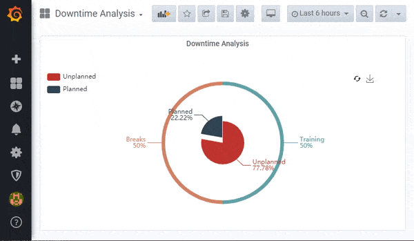
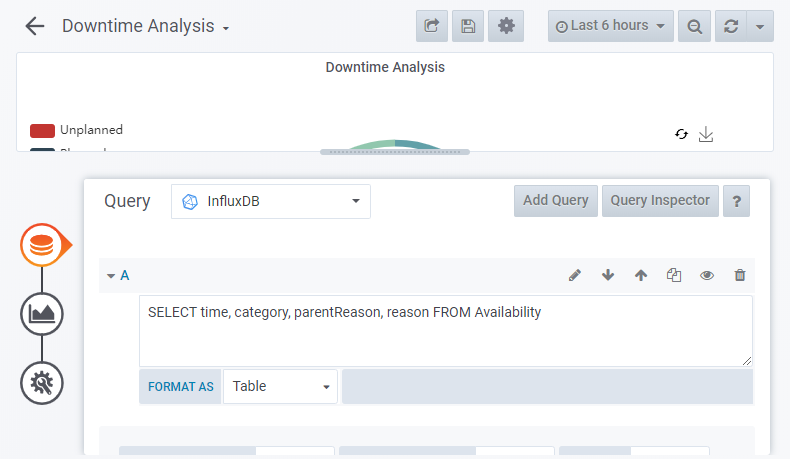

# Downtime Pie Chart Panel

> Libre Panel for Pie Chart Downtime Analysis

This chart visualizes the part-to-whole of downtime categories and reasons. The outer donut is the part-to-whole of the selected inner category. Users can select an inner category to change the outer donut display. Users can toggle between downtime category/reason duration sum and frequency of occurrences. A download button enables saving the graph as an image. Mouseover gives users additional information as to the downtime duration. This panel plugin is part of [Libre](https://github.com/Spruik/Libre).



> This panel has been developed for Grafana v6.x.x only.

## Installation

The easiest way to get started with this plugin is to [download the latest release](https://github.com/Spruik/Libre-Downtime-Pie-Chart-Panel/releases/latest/download/libre-downtime-pie-chart-panel.zip), unzip into grafana plugin directory and restart grafana.

Download the latest release

```shell
$ wget https://github.com/Spruik/Libre-Downtime-Pie-Chart-Panel/releases/latest/download/libre-downtime-pie-chart-panel.zip
Resolving github.com (github.com)... 140.82.114.4
...
2020-06-24 20:47:59 (1.08 MB/s) - 'libre-downtime-pie-chart-panel.zip' saved [90150]
```

Unzip into your Grafana plugin directory

```shell
$ unzip libre-downtime-pie-chart-panel.zip -d /var/lib/grafana/plugins
Archive: libre-downtime-pie-chart-panel.zip
...
inflating: /var/lib/grafana/libre-downtime-pie-chart-panel/utils.js.map
```

Restart Grafana

```shell
$ service grafana-server restart
 * Stopping Grafana Server
 * Starting Grafana Server
```

## Usage

In order to get the most out of this panel:

1. Add a *Table* metric to query Availability. For example `SELECT time, category, reason, parentReason FROM "Availability"`. This panel expects an ordered timeseries of time, category, reason, parentReason. Empty category/reasons are not included.



## Developing

### Getting Started

A docker-compose and grunt script is provided in order to quickly evaluate source code changes. This requires

Prerequisites

- docker (>= 18 required)
- docker-compose (>= 1.25 required)
- node (>= 12 required)
- npm (>= 6 required)

Start by cloning this repository

```shell
~/
$ git clone https://github.com/Spruik/Libre-Downtime-Pie-Chart-Panel
Cloning into 'libre-downtime-pie-chart-panel'...
remote: Enumerating objects: 46, done.
remote: Counting objects: 100% (46/46), done.
remote: Compressing objects: 100% (31/31), done.
remote: Total 46 (delta 13), reused 46 (delta 13), pack-reused 0
Unpacking objects: 100% (46/46), done.
```

Enter project and install dependencies

```shell
$ cd ./libre-downtime-pie-chart-panel
~/libre-downtime-pie-chart-panel
$ npm install
...
added 622 packages in 13.118s
```

Install Grunt globally

```shell
$ npm install grunt -g
C:\Users\user\AppData\Roaming\npm\grunt -> C:\Users\user\AppData\Roaming\npm\node_modules\grunt\bin\grunt
+ grunt@1.1.0
updated 1 package in 1.364s
```

Run grunt to build the panel

```shell
$ grunt
Running "copy:src_to_dist" (copy) task
Created 2 directories, copied 3 files

Running "copy:echarts_libs" (copy) task
Copied 1 file

Running "copy:pluginDef" (copy) task
Copied 1 file

Running "copy:readme" (copy) task
Created 1 directory, copied 7 files

Running "string-replace:dist" (string-replace) task

1 files created

Running "babel:dist" (babel) task

Done.

```

Start docker-compose.dev.yml detached

```shell
~/libre-downtime-pie-chart-panel
$ docker-compose -f docker-compose.dev.yml up -d
Creating network "libre-downtime-pie-chart-panel_default" with the default driver
Creating libre-downtime-pie-chart-panel_influx_1 ... done
Creating libre-downtime-pie-chart-panel_grafana_1  ... done
Creating libre-downtime-pie-chart-panel_telegraf_1 ... done
```

Run grunt watch to recompile on change

```shell
~/libre-downtime-pie-chart-panel
$ grunt watch
Running "watch" task
Waiting...
```

Open your favourite editor and start editing ./src files. The grunt watch task will detect this and recompile the panel. Use your favourite web browser and point to http://localhost:3000 login a dashboard with data should already be available. Your browser will need to be refreshed to reflect your changes to this panel. Ensure your browser isn't caching files whilst developing.

### Building

Prerequisites

- node (>= 12 required)
- npm (>= 6 required)

Build panel and zip into archive

```shell
~/libre-downtime-pie-chart-panel
$ grunt build
Running "clean:0" (clean) task
>> 1 path cleaned.

Running "clean:1" (clean) task
>> 1 path cleaned.

Running "clean:2" (clean) task
>> 1 path cleaned.

Running "copy:src_to_dist" (copy) task
Created 2 directories, copied 3 files

Running "copy:echarts_libs" (copy) task
Copied 1 file

Running "copy:pluginDef" (copy) task
Copied 1 file

Running "copy:readme" (copy) task
Created 1 directory, copied 7 files

Running "string-replace:dist" (string-replace) task

1 files created

Running "babel:dist" (babel) task

Running "compress:main" (compress) task
>> Compressed 26 files.

Running "compress:tar" (compress) task
>> Compressed 26 files.

Done.

```

Find a completed build of this panel in the root directory named `libre-downtime-pie-chart-panel.zip`.

## Contributing

For any issue, there are fundamentally three ways an individual can contribute:

- By opening the issue for discussion: For instance, if you believe that you have uncovered a bug in, creating a new issue in the [GitHub issue tracker](https://github.com/Spruik/Libre-Downtime-Pie-Chart-Panel/issues) is the way to report it.
- By helping to triage the issue: This can be done either by providing supporting details (a test case that demonstrates a bug), or providing suggestions on how to address the issue.
- By helping to resolve the issue: Typically, this is done either in the form of demonstrating that the issue reported is not a problem after all, or more often, by opening a Pull Request that changes some bit of something in the panel in a concrete and reviewable manner.

## Change log

- 1.0.3
  - Update ini 1.3.5 to 1.3.8
  - Bump Revision

- 1.0.2
  - Update README.md
  - Update bl library to 1.2.3
  - Bump revision

- 1.0.1 Add tar build output
  - Remove unused libraries
  - Npm audit fix
  - Add tar build output
  - Update README shell outputs
  - Bump revision

- 1.0.0 Initial Public Release
